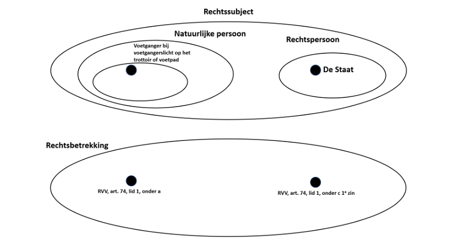
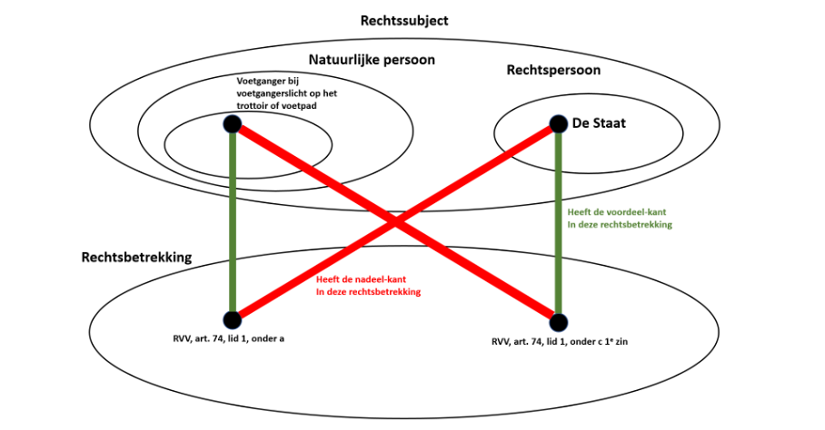
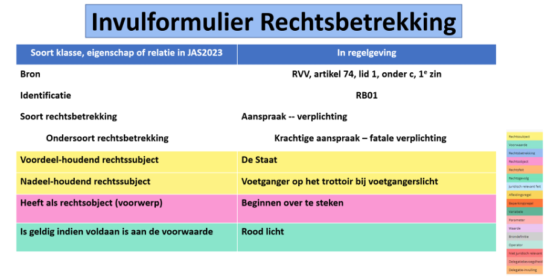
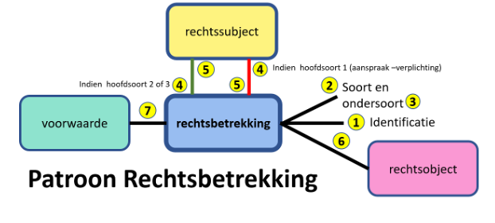
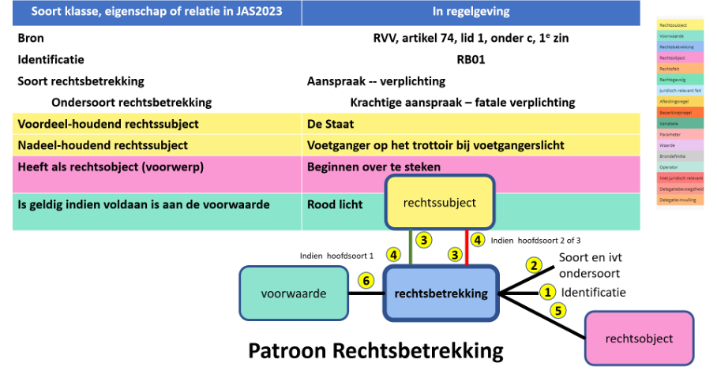

# Rechtsbetrekking in het objectieve recht (wetgeving)
## Wat is een rechtsbetrekking, oftewel de semantiek?
Een rechtsbetrekking is een juridische relatie tussen twee rechtssubjecten, waarbij:

-	die relatie komt met een hoofdsoort, en
-	elke hoofdsoort heeft meer ondersoorten,
-	het ene rechtssubject de voordeel-kant heeft en
-	het andere rechtssubject de nadeel-kant,
-	betreffende het rechtsobject en
-	onder de gespecificeerde voorwaarden.

2.1	Voorbeelden van rechtsbetrekkingen
Twee bekende voorbeelden van rechtsbetrekkingen zijn twee rechtsbetrekkingen binnen het kennisdomein voetgangerslicht.
In het RVV (Reglement Verkeersregels en Verkeerstekens 1990) lezen we het volgende:

>Artikel 74
>
>1.	Bij voetgangerslichten betekent:
>
    a.	groen licht: voetgangers mogen oversteken;
    b.	groen knipperend licht: voetgangers mogen oversteken; het rode licht verschijnt spoedig;
    c.	rood licht: voetgangers mogen niet meer beginnen over te steken; reeds overstekende voetgangers moeten zo snel mogelijk doorlopen.

De doorgestreepte stukken tekst vallen buiten de scope van dit deelhoofdstuk.

Om in lijn te blijven met de voorbeelden gegeven onder rechtssubject, wordt het volgende gezegd:
We zien in de tekst van artikel 74, lid 1 van het RVV (in het niet doorgestreepte deel) twee rechtsbetrekkingen.
Deze rechtsbetrekkingen zouden we kunnen identificeren als:

    1.	RVV, art. 74, lid 1, onder a  en
    2.	RVV, art. 74, lid 1, onder c, 1e zin.

De verwoording van het hierboven afgebeelde van het objectieve recht is als volgt:

Binnen de collectie van alle rechtssubjecttypen in het objectieve recht binnen het kennisdomein Voetgangerslicht identificeert voetganger bij het voetgangerslicht op het trottoir een specifiek rechtssubjecttype.
Binnen de collectie van alle rechtssubjecttypen in het objectieve recht binnen het kennisdomein Voetgangerslicht identificeert de Staat een specifiek rechtssubjecttype.
Het rechtssubjecttype voetganger bij het voetgangerslicht op het trottoir is een specialisatie van het rechtssubjecttype natuurlijke persoon.
Het rechtssubjecttype natuurlijke persoon is een specialisatie van het rechtssubjecttype rechtssubject.
Het rechtssubjecttype de Staat is een instantie van het rechtssubject rechtspersoon, en dat is een specialisatie van rechtssubject.
U ziet dat een schema heel veel samenhangende kennis bevat. Deze kennis kan volledig weergegeven worden in gestructureerde tekst. Dat is gewoon een andere kijk op exact dezelfde kennis. Maar nu is er keuze en de nieuwe mogelijkheid heel innovatief om te gaan met de gestructureerde weergave. Dat in tegenstelling met de gebruikelijke wettekst waar weinig innovatiefs mee te doen is.

## Welke uitdrukkingen over rechtsbetrekkingen zijn toegestaan, oftewel de syntax?
Van een rechtsbetrekking zijn de volgende hierna te bespreken uitdrukkingen volgens het juridische analyseschema toegestaan.  
Rechtssubject <rechtssubject-identificatie> heeft de <soort-rechtsbetrekking> en ondersoort <ondersoort>, heeft als voordeel-houdend rechtssubject <rechtssubject-v>, heeft als voorwerp het rechtsobject  <rechtsobject>, is alleen geldig indien aan de voorwaarde  <voorwaarde> voldaan is en <rechtssubject-n> heeft <nadeel-kant> hierop.

Termen tussen dit paar haken <    > geven variabelen weer

In een schema kan dit bovenstaand tekstueel patroon als volgt worden weergegeven:

##	Elke rechtsbetrekking in het objectieve recht krijgt een identificatie toegewezen
Elke rechtsbetrekking krijgt binnen zijn kennisdomein een korte identificatie toegewezen waar bovendien RB als eerste twee karakters optreedt. Daarmee kan in een interactieve mode binnen het kennisdomein heel handig worden geopereerd. Bijv. binnen het kennisdomein RVV art v74, lid 1 geven we de eerste rechtsbetrekking de identificatie RB01.

## Hoofdsoort van de rechtsbetrekking
Aan elke rechtsbetrekking kennen we de hoofdsoort toe. Tevens kennen voor elke rechtsbetrekking een ondersoort toe.
De drie hoofdsoorten zijn:

-	Aanspraak – verplichting
-	Verlof – geenaanspraak
-	Bevoegdheid – gehoudenheid.

Voor de hoofdsoort aanspraak – verplichting geldt dat de verplichting-houder het actieve rechtssubject is. Deze dient een verplichting na te komen; de voordeel-houder heeft een aanspraak op het nakomen van de verplichting.

Voor de hoofdsoort verlof – geenspraak geldt dat het voordeel-houdend rechtssubject het actieve rechtssubject is. Deze heeft het verlof, ook vaak aangeduid als de vrijheid, om al dan niet gebruik te maken van zijn verlof. Denk aan de houder van een rijbewijs. Deze kan gebruik maken van zijn rijbewijs en dan heeft de geenaanspraakhouder, in dit geval de Staat, het gebruik van het rijbewijs maar te accepteren.

Voor de hoofdsoort bevoegdheid – gehoudenheid geldt dat de voordeel-houder het actieve rechtssubject is. Hij heeft de bevoegdheid een
-	nieuwe rechtsbetrekking of juridisch relevant feit in het leven te roepen,
-	een eigenschap van een bestaande rechtsbetrekking of een bestaand juridisch relevant feit te wijzigen, en/of
-	een bestaande rechtsbetrekking of juridisch relevant feit ten einde te stellen.
De gehoudenheidshouder kan hier niets tegen inbrengen.

##	De ondersoort van de rechtsbetrekking
Aan elke rechtsbetrekking dienen we ook de ondersoort van de rechtsbetrekking aan te geven.
Voor de hoofdsoort aanspraak – verplichting hebben we drie ondersoorten:

- Krachtige aanspraak – fatale verplichting
-	Aanspraak na ingebrekestelling – verplichting na ingebrekestelling
-	Zwakke aanspraak – zwakke verplichting.

Bij een krachtige aanspraak – fatale verplichting geldt dat, indien de plichthouder zijn plicht niet vervult, de aanspraakhouder meteen de bevoegdheid (een ander soort rechtsbetrekking) krijgt de overtredende plichthouder een sanctie op te leggen (een nieuwe rechtsbetrekking van het soort fatale verplichting, meestal een boete of hogere boete dan de vorige boete).

Bij een aanspraak na ingebrekestelling dient bij niet nakomen van de plicht door de plichthouder de aanspraakhouder de plichthouder eerst in gebreke te stellen. Daardoor wordt de verplichting ‘verhoogd’ tot fatale verplichting.

Bij een zwakke aanspraak – zwakke verplichting heeft de aanspraakhouder, indien de plichthouder verzaakt, niet de bevoegdheid een sanctie op te leggen, of een ingebrekestelling. Wel ontstaat er een juridisch relevant feit dat bij een rechtszaak meegenomen kan worden door de rechter. Een voorbeeld hiervan is bijvoorbeeld artikel 2, lid 4 van de Wet flexibel werken.  

Er zijn rechtsbetrekkingen van verlof waarbij een handeling door de recht-houder leidt tot een rechtsfeit. Bijv. bij het verlof eerder te mogen betalen dan de fatale datum van een boete bij het betrapt worden door een bevoegde bij rood licht te beginnen met oversteken vanaf het voetpad of trottoir bij een voetgangerslicht. Het gebruik maken van eerder te mogen betalen dan de fatale datum heeft als formeel logische consequentie dat daarmee voldaan wordt aan de fatale betaalverplichting.
Door een rechtsbetrekking van verlof tijdens het opstellen of analyseren van wetgeving een van deze twee ondersoorten toe te kennen in het multidisciplinaire team kunnen overbodige lange gesprekken vermeden worden en kan de kwaliteit van de uitvoering verhoogd worden.
De ondersoorten van de hoofdsoort verlof zijn:

-	Wel rechtsfeitbaar
-	Niet rechtsfeitbaar

Voor de hoofdsoort bevoegdheid – gehoudenheid hebben we twee ondersoorten, te weten:

-	een optionele bevoegdheid en
-	een verplichte bevoegdheid

Een verplichte bevoegdheid treedt vaak op als de Overheid een rechtsbeginsel dient te respecteren, zoals gelijke behandeling.

##	Van een rechtsbetrekking willen we steeds het nadeel-houdende rechtssubject aanwijzen of toevoegen
Bij een rechtsbetrekking van de hoofdsoort aanspraak – verplichting is de plichthouder de actieveling. Van de andere twee hoofdsoorten is de recht-houder de actieveling. In wetgeving wordt zelden zowel de ene als de andere kant van een rechtsbetrekking expliciet weergegeven. Meestal wordt de actieveling weergegeven.
Hoewel we voor de modelrepresentatie beide rechtssubjecten van een rechtsbetrekking expliciet willen weergeven, is het in een best practice of methode wel handig om eerst de in de wetgeving aangegeven  rechtssubject te modelleren. Dat betekent dat in een best practice de volgorde van het vaststellen of toevoegen van de twee betrokken rechtssubjecten voor deze twee gestructureerde feiten verschillend is, afhankelijk van de hoofdsoort, of stapje 4 en dan 5, of stapje 5 en dan 4.
Het nadeel-houdende rechtssubject is bij RVV art 74, lid 1 onder c, 1e zin de voetganger op het trottoir of voetpad bij het voetgangerslicht.
Het voordeel-houdende rechtssubject in deze rechtsbetrekking is de Staat.

## Van een rechtsbetrekking willen we steeds het voordeel-houdende rechtssubject aanwijzen of toevoegen
Elke rechtsbetrekking heeft ook een nadeel-houdend rechtssubject. Bij de hoofdsoort verlof en bevoegdheid is die zelden beschreven in wetgeving. In dat geval is het zaak dat het MDT het nadeel-houdende rechtssubject expliciet toevoegt aan het model.

## Een rechtsbetrekking heeft altijd een rechtsobject
Kijken we naar de tekst van de regelgeving:

>Artikel 74
>
>1.	Bij voetgangerslichten betekent:
>
    a.	groen licht: voetgangers mogen oversteken;
    b.	groen knipperend licht: voetgangers mogen oversteken; het rode licht verschijnt spoedig;
    c.	rood licht: voetgangers mogen niet meer beginnen over te steken; reeds overstekende voetgangers moeten zo snel mogelijk doorlopen.

‘beginnen over te steken’ is datgene wat niet mag. Dat is het voorwerp van de rechtsbetrekking, oftewel het rechtsobject.

## Een rechtsbetrekking is altijd gebonden aan een voorwaarde
In deze rechtsbetrekking geldt als voorwaarde ‘bij rood voetgangerslicht’.
Een voorwaarde heeft betrekking op 1 of meer juridisch relevante feiten.
Een juridisch relevant feit is gedefinieerd als een feit dat in een voorwaarde op een rechtssubject, rechtsbetrekking of rechtsfeit voorkomt, of in een rechtsobject, of in een afleidingsregel.

## Tussentijdse samenvatting
Laten we nu eens kijken hoe een aantal gestructureerde gegevens betreffende rechtssubjecten en rechtsbetrekkingen samenhangt.

De verwoording van bovenstaande gestructureerde gegevens (vier voorbeelden van relaties tussen een rechtssubject en een rechtsbetrekking) is als volgt: (waarbij we de identificatiefeiten niet herhalen.)

- In de rechtsbetrekking RVV, art. 74, lid 1, onder a heeft het rechtssubjecttype voetganger bij het voetgangerslicht op het trottoir of voetpad de voordeel-kant.
- In de rechtsbetrekking RVV, art. 74, lid 1, onder a heeft het rechtssubjecttype de Staat de nadeel-kant.
- In de rechtsbetrekking RVV, art. 74, lid 1, onder c, 1e zin; heeft het rechtssubjecttype de Staat  de voordeel-kant.
- In de rechtsbetrekking RVV, art. 74, lid 1, onder c, 1e zin; heeft het rechtssubjecttype voetganger bij het voetgangerslicht op het trottoir of voetpad de nadeel-kant.

Wat betekent de tekst onder a?
Als een voetganger op het trottoir of voetpad staat bij een voetgangerslicht en het licht is groen, dan heeft de voetganger de voordeel-kant in de rechtsbetrekking om te mogen oversteken en de Staat heeft de nadeel-kant, met de mooie term geenaanspraak. Dit is een rechtsbetrekking van het soort verlof. De Staat heeft de beslissing van de voetganger maar te accepteren, of hij nu oversteekt of prefereert op het trottoir of voetpad te blijven staan.

Wat betekent de tekst onder c, eerste zin?
Als een voetganger op het trottoir of voetpad staat bij een voetgangerslicht en het licht is rood, dan heeft de voetganger de nadeel-kant in de rechtsbetrekking niet meer beginnen over te steken en de Staat heeft de voordeel-kant met de mooie term krachtige aanspraak. Dit is een rechtsbetrekking van het soort fatale verplichting. De voetganger krijgt bij overtreding en vaststelling door een daartoe bevoegde, een flinke geldboete van het CJIB (Centraal Justitieel Incasso Bureau), en niet eerst een vriendelijke waarschuwing.
En wat is het rechtsobject van deze rechtsbetrekking?
Beginnen over te steken.

En wat is de voorwaarde bij deze rechtsbetrekking?
Dat het voetgangerslicht op groen staat.
We kunnen hier nog nuttig een afgeleid feit aan toevoegen: wie is het actieve rechtssubject in deze rechtsbetrekking?
Dat is de voetganger op het trottoir bij een voetgangerslicht.
Als we bovenstaande soorten feiten noteren van de tweede rechtsbetrekking (RVV, art. 74, lid, onder c, 1e zin, krijgen we de volgende reeks:

1.	De rechtsbetrekking krijgt de identificatie RB01 binnen het kennisdomein RVV art 74, lid 1.
2.	Het is een rechtsbetrekking van de hoofdsoort verplichting.
3.	Het is een rechtsbetrekking van de ondersoort fatale verplichting.
4.	Het nadeel-houdend rechtssubject is de voetganger op het trottoir of voetpad bij een voetgangerslicht.
5.	Het voordeel-houdend rechtssubject is de Staat.
6.	Het rechtsobject van deze rechtsbetrekking is beginnen over te steken.
7.	De voorwaarde bij deze rechtsbetrekking is dat het voetgangerslicht op rood staat.

Maar wat leert de praktijk van alledag bij een voetgangerslicht ?

Dat je als voetganger op het trottoir op een knop kunt drukken en dan wordt enkele seconden later het voetgangerslicht groen.

## Het patroon met zeven gestructureerde gegevens rond rechtsbetrekking
Het patroon rond rechtsbetrekking hebben we eveneens nodig om adequaat antwoord te kunnen geven op de twee vragen van de burger:

-	wat mag ik hier doen?
-	waar moet me hier aan houden?

Een persoon opgeleid in de Master Classes Wetsmodelleren I en II en die met succes de daarbij behorende examens heeft afgelegd gaat gemiddeld binnen enkele minuten tot de voorlopige conclusie komen dat we bij de brontekst van RVV, art 74, lid 1 zoals hieronder weergegeven, te doen hebben met 4 verschillende rechtsbetrekkingen.

>Artikel 74
>
>1.	Bij voetgangerslichten betekent:
>
    a.	groen licht: voetgangers mogen oversteken;
    b.	groen knipperend licht: voetgangers mogen oversteken; het rode licht verschijnt spoedig;
    c.	rood licht: voetgangers mogen niet meer beginnen over te steken; reeds overstekende voetgangers moeten zo snel mogelijk doorlopen.

We zullen ons nader onderzoek uitvoeren aan de hand van het patroon voor rechtsbetrekking. We zullen dat eerst toelichten aan de hand van het concrete geval van het voetgangerslicht, te weten artikel 74, lid 1, onder c, 1e zin:

>Artikel 74
>
>1.	Bij voetgangerslichten betekent:
>
    a.	groen licht: voetgangers mogen oversteken;
    b.	groen knipperend licht: voetgangers mogen oversteken; het rode licht verschijnt spoedig;
    c.	rood licht: voetgangers mogen niet meer beginnen over te steken; reeds overstekende voetgangers moeten zo snel mogelijk doorlopen.

We zien in bovenstaande niet-doorgestreepte tekst dat we te doen hebben met een rechtsbetrekking.

##	Invulformulier voor rechtsbetrekking
We beginnen met het invullen van het concrete formulier met de 7 gestructureerde gegevens van de rechtsbetrekking in bovenstaande tekst, zeg onder 1, 1e zin.
We zien in het ingevulde formulier hieronder dat we 7 gestructureerde gegevens van een rechtsbetrekking bevolken in het wetsmodel. Het achtste gestructureerde gegeven is de annotatie tussen de rechtsbetrekking in de tekst van het RVV art. 74, lid 1 en in het wetsmodel daarvan, mogelijk aangevuld op basis van de kennis van het juridisch analysemodel 2023.
Het eerste gestructureerde gegeven van een rechtsbetrekking is een additionele identificatie voor deze rechtsbetrekking binnen het kennisdomein RVV, art 74, lid 1, in dit geval RB01. Deze korte identificatie is nuttig in het verder snel kunnen werken met deze gestructureerde gegevens van deze rechtsbetrekking.
Het tweede gestructureerde gegeven van een rechtsbetrekking is de hoofdsoort. Zoals we eerder hebben gezien, is de hoofdsoort te kiezen uit de volgende 3:

-	Aanspraak – verplichting
-	Verlof – geenaanspraak
-	Bevoegdheid – gehoudenheid.

De tekst ‘mogen niet meer’ duidt duidelijk op een verplichting. Dus als hoofdsoort stellen we vast:

Aanspraak – verplichting

We weten op grond van het JAS2023 dat we bij die hoofdsoort drie ondersoorten hebben waar we uit dienen te kiezen, te weten:

-	Krachtige aanspraak – fatale verplichting
-	Aanspraak na ingebrekestelling – verplichting na ingebrekestelling
-	Zwakke aanspraak – zwakke verplichting.

Helaas is in art 74 of elders in het RVV nergens informatie te vinden waar we de beslissing voor een selectie van de subsoort op kunnen baseren.
Gelukkig is er veel volkswijsheid op dit punt. Jaarlijks worden duizenden mensen betrapt met door rood beginnen te lopen en dat resulteert in een boete van meer dan 60 euro. Dus laten we veiligheidshalve op grond van deze volkswijsheid kiezen voor een fatale verplichting, dus meestal zonder voorafgaande waarschuwing.  

##	Het patroon rond rechtsbetrekking
Het patroon rond rechtsbetrekking laat de gestructureerde gegevenstypes zien.

## De samenhang tussen patroon en ingevuld formulier bij rechtsbetrekking
Het patroon van rechtsbetrekking is op het niveau van een grammatica en niet van een concrete uitdrukking die aan de grammatica voldoet. In het formulier is de grammatica aan de linkerkant; de invulling van de uitdrukking aan de rechterkant van het formulier.

We kunnen de bovengenoemde connecties op grammatica niveau tussen de elementen van het patroon en de linkerkant van het formulier (de regels in het formulier) ook met een gestippelde lijn met aan beide kanten een pijlpunt toelichten, zoals hieronder weergegeven.
