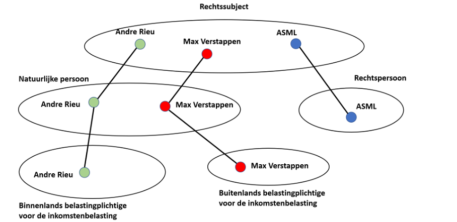

# Rechtssubject in het objectieve recht (wetgeving)
## Wat is een rechtssubject, oftewel de semantiek?
In dit hoofdstuk gaan we de semantische (wat betekent een term?) en syntactische regels (welke uitdrukkingen met deze term zijn toegestaan?) beschrijven van het onderdeel Rechtssubject van de logisch formele, declaratieve en breed begrijpelijke taal met de naam WetsTaal. Met deze taal worden voor zowel de wetgeving als de wetsuitvoering modellen opgesteld waarmee de wetsuitvoering vanaf het begin van het wetgevingsproces getest kan worden.
Dat betekent dat wetgeving op die manier opgesteld volledig is, breed begrijpelijk en waarbij de computer effectief kan worden ingeschakeld om de complexiteit te minimaliseren. De taal is een zogenaamde gecontroleerde natuurlijke taal. Dat betekent zowel begrijpelijk voor de meerderheid van de mensen als computers.
Beide beschrijvingen spelen een belangrijke rol bij wetgeving en wetsanalyse op basis van patroonherkenning, zoals ook in een aantal andere exacte wetenschappen met groot succes wordt gebruikt. Bij die patroonherkenning willen we bewust een stuk overtolligheid inbouwen om in situaties waarin meer dan een enkel gestructureerd gegeven in de juridische bron ontbreekt, de patroonherkenning effectief te laten werken.

## Waarom beginnen we met rechtssubject?
De structuur van wetgeving die sinds 2012 steeds meer in kaart is gebracht, anders gezegd is gemodelleerd in een logisch formeel, declaratief en breed begrijpelijk model, laat zien dat rechtssubject als eerste vereist is om andere fundamentele begrippen van wetgeving en wetsuitvoering zoals rechtsbetrekking, rechtsfeit en rechtsgevolg te kunnen beschrijven.
De structuur van wetgeving  is sinds 2012 steeds meer bloot gelegd op basis van het modelleren van de:

- begripsomschrijvingen,
- gegevens,
- regels, en
- processen.

Hierbij is voor elke term gebruikt in gegevens, regels of processen die niet als glashelder kan worden aangeduid voor de meerderheid van de Nederlanders, een begripsomschrijving opgesteld. Deze structuur blijkt behoorlijk krachtig te zijn. Door die kracht volledig te expliciteren kan deze kennis gebruikt worden tijdens alle stappen van het wetgevings- en wetsuitvoeringsproces.
Die structuur is tot nu toe onvoldoende en vaak geheel niet beschreven in de leerboeken Inleiding Rechtsgeleerdheid. Vanuit dat perspectief is het heel goed te verklaren waarom er zo veel misgaat in wetsuitvoering dat zelfs de eerste minister het woord schande gebruikt.
Het niet bewust zijn van die structuur in de leerboeken voor het opstellen van wetgeving kan aangemerkt worden als de voornaamste oorzaak van de problemen in de wetsuitvoering. Maar de wetgevingsjuristen zijn eigenlijk slachtoffer van het feit dat zij tijdens hun opleiding niet bekend gemaakt zijn met kennisanalysetechnieken en de onderliggende structuur van wetgeving. Zou dat wel het geval zijn, dan zou de kwaliteit van wetgeving structureel veel hoger liggen.

##	Wat is een rechtssubject?
De begripsdefinitie van de term rechtssubject:

Een rechtssubject is
- de drager van rechten en plichten, en/of
- de generator van juridisch relevante feiten, en/of
- de uitvoerder van rechtshandelingen en feitelijke handelingen met rechtsgevolg.

Eem juridisch relevant feit is een feit dat voorkomt in een
- voorwaarde, en/of
- rechtsobject en/of
-	afleidingsregel

van een model voor wetgeving of wetsuitvoering.
Een rechtshandeling heeft rechtsgevolgen en een beoogd doel.
Een feitelijke handeling met rechtsgevolg heeft rechtsgevolgen, maar beoogt die rechtsgevolgen niet.

## Opbouw van de kennis
Een axiomatische benadering zou als volgt kunnen zijn.
De begrippen achter de termen voordeel en nadeel worden bekend verondersteld.
Een recht is een soort voordeel.
Een plicht is een soort nadeel.

## Voorbeelden van rechtssubjecten

In onderstaand diagram zijn een aantal voorbeelden van rechtssubjecten gegeven die bij veel Nederlanders bekend zijn.

